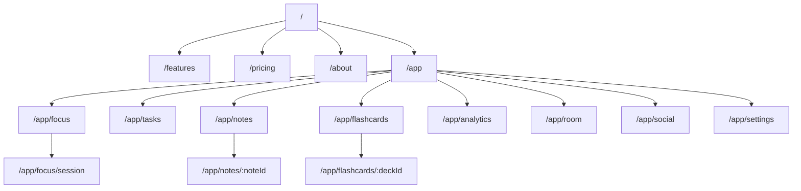
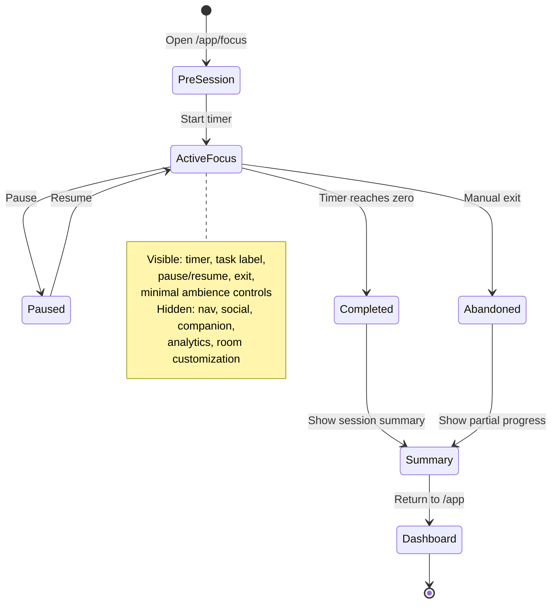

# Komorebie — Sitemap, Route Map & User Flows

> **Repo reality**: `Vite + React 19 + React Router + TypeScript`
> **Target backend**: `Supabase` after core frontend flow stabilizes
> **Design system**: `Zen System`

## 1. Full Sitemap

```text
Komorebie
│
├── Marketing Site
│   ├── /                          Home
│   ├── /features                  Feature deep-dive
│   ├── /pricing                   Free vs premium positioning
│   ├── /about                     Brand story / manifesto
│   └── /legal
│       ├── /legal/privacy
│       └── /legal/terms
│
└── App
    ├── /app                       Sanctuary dashboard / task capture
    ├── /app/focus                 Focus setup
    ├── /app/focus/session         Active focus mode
    ├── /app/tasks                 Task library
    ├── /app/notes                 Note library
    ├── /app/notes/:noteId         Note detail + AI actions
    ├── /app/flashcards            Deck library
    ├── /app/flashcards/:deckId    Deck detail
    ├── /app/analytics             Session analytics
    ├── /app/room                  Companion and room customization
    ├── /app/social                Ambient presence + leaderboard
    └── /app/settings              Preferences
```

## 2. Route Map For This Repo

```text
src/
├── App.tsx
├── components/
│   ├── layout/
│   │   ├── AppLayout.tsx
│   │   └── SmoothScroll.tsx
│   ├── three/
│   │   └── ZenEnvironment.tsx
│   └── ui/
│       └── GlassCard.tsx
└── pages/
    ├── LandingPage.tsx
    ├── FeaturesPage.tsx
    ├── PricingPage.tsx
    ├── AboutPage.tsx
    ├── LegalPrivacyPage.tsx
    ├── LegalTermsPage.tsx
    ├── TaskCapture.tsx
    ├── FocusSetup.tsx
    ├── FocusSession.tsx
    ├── TaskLibrary.tsx
    ├── NotesLibrary.tsx
    ├── NoteDetail.tsx
    ├── FlashcardLibrary.tsx
    ├── FlashcardDeck.tsx
    ├── FlowAnalytics.tsx
    ├── RoomPage.tsx
    ├── SocialPage.tsx
    └── SettingsPage.tsx
```

## 3. Route Hierarchy



## 4. User Flows

### 4.1 New Visitor To First Focus Session

```mermaid
flowchart LR
    A([Land on /]) --> B[Understand premium calm value]
    B --> C{Click primary CTA}
    C --> D[/app]
    D --> E[Type or select task]
    E --> F[/app/focus]
    F --> G[Confirm session settings]
    G --> H[/app/focus/session]
    H --> I[Run focus session]
    I --> J[Show session summary]
    J --> K[/app or /app/analytics]
```

### 4.2 Returning User Quick Start

```mermaid
flowchart LR
    A([Open /app]) --> B[Load last task and ambience defaults]
    B --> C{Resume or start new}
    C -->|Resume| D[/app/focus/session]
    C -->|New| E[/app/focus]
    E --> D
```

### 4.3 Notes To Flashcards

```mermaid
flowchart TD
    A([Open /app/notes]) --> B[Upload or select note]
    B --> C[AI parses note]
    C --> D[/app/notes/:noteId shows summary]
    D --> E{Generate flashcards}
    E --> F[Save deck to /app/flashcards/:deckId]
    F --> G[Study now or later]
```

### 4.4 Focus Mode State Model



## 5. Layout Zones

| Zone | Focus Mode | Sanctuary Dashboard | Marketing |
|---|---|---|---|
| Nav | Hidden | Minimal app nav | Full header |
| 3D canvas | Ambient only | Lightweight interactive | Hero only |
| Timer | Primary | Secondary widget | none |
| AI panel | Hidden | Secondary | none |
| Social | Hidden | Ambient only | none |
| Companion | Hidden | Secondary | teaser only |

## 6. Open Decisions

1. Keep current prototype unauthenticated until core flows stabilize, or add auth now?
2. Split task capture and focus setup into separate routes, or keep one screen with progressive reveal?
3. Make notes and flashcards MVP routes, or phase them after session flow stability?
4. Keep 3D ambience globally mounted, or load it only where it adds value?
5. Lock the product name as `Komorebie` or rename before more implementation?

## 7. Recommended Implementation Order

1. Lock sitemap and route map
2. Refactor router to match approved route skeleton
3. Audit current UI against Zen System and focus constraints
4. Fix current lint and UX issues
5. Add missing page scaffolds
6. Define backend and AI contracts
