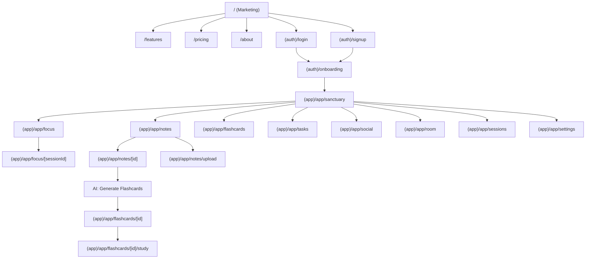
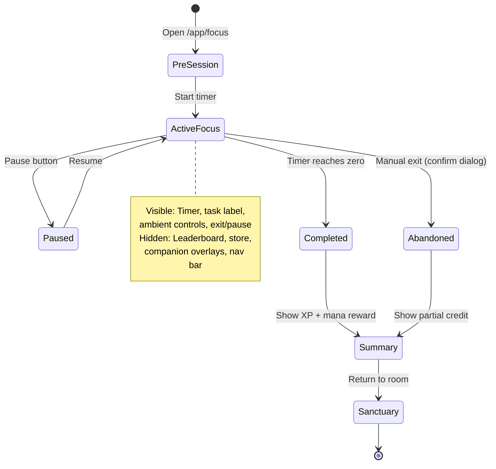
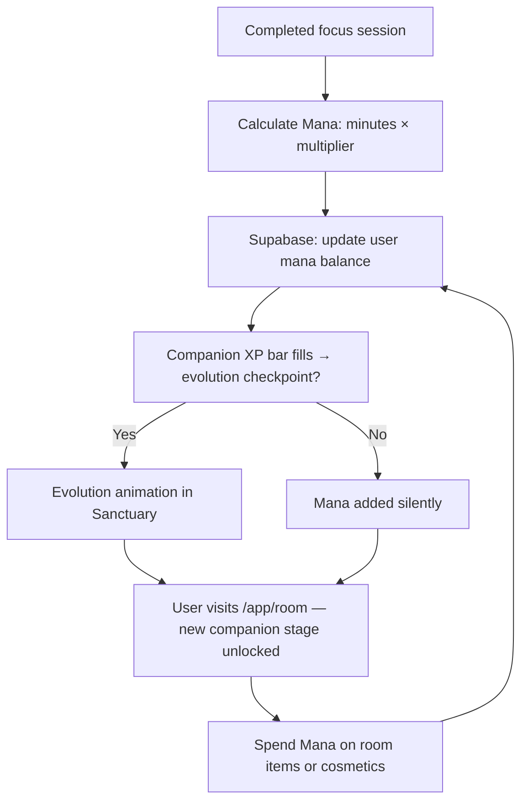

# Komorebie — Sitemap, Route Map & User Flows

> **Repo**: `git@github.com:flcsezz/Komorebie.git`  
> **Stack**: Next.js 15 App Router · Supabase · R3F · Framer Motion · Gemini AI  
> **Design system**: Luminous Glass (Obsidian + Cyan `#00F2FF` + Electric Purple `#9D00FF`)

---

## 1. Full Sitemap

```
Komorebie (Komorebie)
│
├── Marketing Site  (unauthenticated)
│   ├── /                          Home — Hero, value prop, 3D scene teaser
│   ├── /features                  Feature deep-dive (immersion, AI, progression, social)
│   ├── /pricing                   Free vs Premium tiers
│   ├── /about                     Brand story / manifesto
│   ├── /changelog                 Public changelog
│   └── /legal
│       ├── /legal/privacy         Privacy policy
│       └── /legal/terms           Terms of service
│
├── Auth  (shared shell)
│   ├── /login                     Email / OAuth sign-in
│   ├── /signup                    Registration + welcome flow
│   ├── /onboarding                3-step first-run wizard
│   └── /forgot-password           Password reset
│
└── App  (authenticated, behind /app layout)
    │
    ├── /app                       Redirects → /app/sanctuary (default)
    │
    ├── /app/sanctuary             Sanctuary Mode — 3D room, companion, ambient social
    │
    ├── /app/focus                 Focus Mode shell
    │   └── /app/focus/[sessionId] Active focus session
    │
    ├── /app/tasks                 Task manager
    │   ├── /app/tasks             Today view
    │   └── /app/tasks/[id]        Task detail / edit
    │
    ├── /app/notes                 Note library
    │   ├── /app/notes             All notes + search
    │   ├── /app/notes/upload      Upload / paste note
    │   └── /app/notes/[id]        Note viewer + AI panel
    │
    ├── /app/flashcards            Flashcard library
    │   ├── /app/flashcards        All decks
    │   ├── /app/flashcards/[id]   Deck viewer
    │   └── /app/flashcards/[id]/study  Active study session (spaced repetition)
    │
    ├── /app/sessions              Session history + analytics
    │
    ├── /app/social                Social layer
    │   ├── /app/social            Ambient leaderboard + friend presence
    │   └── /app/social/[username] Friend profile
    │
    ├── /app/room                  Room & companion customization store
    │
    └── /app/settings              User settings
        ├── /app/settings/profile  Profile & avatar
        ├── /app/settings/audio    Sound & music preferences
        ├── /app/settings/appearance  Theme, environment defaults
        └── /app/settings/billing  Subscription & plan
```

---

## 2. Route Map (Next.js App Router)

```
app/
├── layout.tsx                     Root layout (fonts, providers, analytics)
├── page.tsx                       → Marketing Home
├── features/page.tsx
├── pricing/page.tsx
├── about/page.tsx
├── changelog/page.tsx
├── legal/
│   ├── privacy/page.tsx
│   └── terms/page.tsx
│
├── (auth)/                        Auth group layout (centered card, Luminous Glass)
│   ├── layout.tsx
│   ├── login/page.tsx
│   ├── signup/page.tsx
│   ├── onboarding/page.tsx
│   └── forgot-password/page.tsx
│
└── (app)/                         Authenticated app group layout
    ├── layout.tsx                 Supabase session guard + sidebar shell
    ├── app/
    │   ├── page.tsx               Redirect → /app/sanctuary
    │   ├── sanctuary/
    │   │   └── page.tsx           Sanctuary Mode (R3F canvas + glass HUD)
    │   ├── focus/
    │   │   ├── page.tsx           Focus pre-session config
    │   │   └── [sessionId]/
    │   │       └── page.tsx       Active session (timer-first layout)
    │   ├── tasks/
    │   │   ├── page.tsx
    │   │   └── [id]/page.tsx
    │   ├── notes/
    │   │   ├── page.tsx
    │   │   ├── upload/page.tsx
    │   │   └── [id]/page.tsx
    │   ├── flashcards/
    │   │   ├── page.tsx
    │   │   └── [id]/
    │   │       ├── page.tsx
    │   │       └── study/page.tsx
    │   ├── sessions/page.tsx
    │   ├── social/
    │   │   ├── page.tsx
    │   │   └── [username]/page.tsx
    │   ├── room/page.tsx
    │   └── settings/
    │       ├── layout.tsx         Settings sub-nav
    │       ├── profile/page.tsx
    │       ├── audio/page.tsx
    │       ├── appearance/page.tsx
    │       └── billing/page.tsx
```

### Route Hierarchy (Mermaid)



---

## 3. User Flows

### 3.1 New User — First Session

```mermaid
flowchart LR
    A([Land on /]) --> B[View hero + 3D teaser]
    B --> C{CTA: Start Free}
    C --> D[/signup — email + password]
    D --> E[Supabase creates user]
    E --> F[/onboarding Step 1: Choose default environment]
    F --> G[Onboarding Step 2: Pick study goal & timer style]
    G --> H[Onboarding Step 3: Optional — upload first note]
    H --> I[/app/sanctuary — 3D room loads, companion appears]
    I --> J{User clicks Start Focus}
    J --> K[Focus pre-config sheet — task + duration]
    K --> L[/app/focus/sessionId — Full focus mode]
    L --> M[Timer runs, ambient music plays]
    M --> N{Session ends or paused}
    N --> O[Session summary card — XP earned, mana gained]
    O --> P[/app/sanctuary — room reacts to completed session]
```

### 3.2 Returning User — Quick Start (< 10 seconds)

```mermaid
flowchart LR
    A([Open app — already authed]) --> B[/app/sanctuary auto-loads last environment]
    B --> C[Companion + ambient state restored]
    C --> D{One-tap: Resume Last Session or New Session}
    D -->|New| E[Pre-config sheet with last task pre-filled]
    D -->|Resume| F[/app/focus/sessionId — straight to timer]
    E --> F
```

### 3.3 AI Sidekick — Note → Flashcard Flow

```mermaid
flowchart TD
    A([User in /app/notes]) --> B[Click Upload Note]
    B --> C[/app/notes/upload — paste text or upload PDF/image]
    C --> D[Supabase Storage receives file]
    D --> E[Edge Function: parse + embed note]
    E --> F[/app/notes/id — Note viewer opens]
    F --> G[AI panel renders: Summary · Key points · Focus tasks]
    G --> H{User taps Generate Flashcards}
    H --> I[Gemini Edge Function — generates card set]
    I --> J[New deck appears in /app/flashcards]
    J --> K[User taps Study Deck → /app/flashcards/id/study]
    K --> L[Spaced-repetition card loop — SR algorithm]
    L --> M[Session XP earned]
```

### 3.4 Focus Mode — UI State Machine



### 3.5 Social — Ambient Presence Flow

```mermaid
flowchart LR
    A[User enters Sanctuary] --> B[Supabase Realtime channel subscribed]
    B --> C{Friends in active focus?}
    C -->|Yes| D[Ambient silhouettes appear in room at low opacity]
    C -->|No| E[Room feels solo — no indicator]
    D --> F{User hovers silhouette}
    F --> G[Minimal tooltip: friend name + session duration]
    G --> H{User taps social button}
    H --> I[/app/social — Leaderboard + presence grid]
    I --> J[Click friend → /app/social/username]
```

### 3.6 Progression — Mana Economy Loop



---

## 4. Layout Zones

| Zone | Focus Mode | Sanctuary Mode | Marketing |
|---|---|---|---|
| **Nav bar** | Hidden | Collapsed icon rail | Full header |
| **3D canvas** | Ambient only (blurred bg) | Full interactive | Hero section only |
| **Timer** | Primary — center stage | Compact widget | — |
| **AI panel** | Hidden | Accessible via icon | — |
| **Social presence** | Hidden | Ambient silhouettes | — |
| **Companion** | Hidden | Full stage | Teaser only |
| **Room store** | Hidden | Available | — |

---

## 5. Open Decisions for Review

> [!IMPORTANT]
> The following need a call before scaffolding begins.

1. **Onboarding depth** — 3-step wizard as shown, or inline first-session contextual hints instead?
2. **Focus URL** — Does `/app/focus/[sessionId]` need to be bookmarkable / shareable, or is session state ephemeral (sessionStorage only)?
3. **Social auth** — Google OAuth only, or also GitHub/Discord? (Discord aligns with the student demographic)
4. **Mobile** — PWA with service worker for offline timer resilience, or native mobile is a separate phase?
5. **Spline vs R3F** — Authored Spline scenes for marketing + default environments, fully programmatic R3F for in-session reactivity?
6. **Mana naming** — Keep "Mana" as internal currency label or rename to something more thematically tied to "Komorebie" (dappled light metaphor)?

---

## 6. Next Actions (maps to task-board.md)

| Priority | Task | Owner |
|---|---|---|
| 1 | Scaffold Next.js 15 App Router repo in this workspace | Agent |
| 2 | Create route group layouts: `(auth)`, `(app)` | Agent |
| 3 | Implement Supabase auth middleware & session guard | Agent |
| 4 | Build Marketing Home page with hero + R3F teaser | Agent |
| 5 | Define Supabase schema: users, sessions, notes, flashcards, progression | Agent |
| 6 | Build Focus Mode page — timer-first, minimal chrome | Agent |
| 7 | Wire AI sidekick Edge Function for notes → flashcards | Agent |
